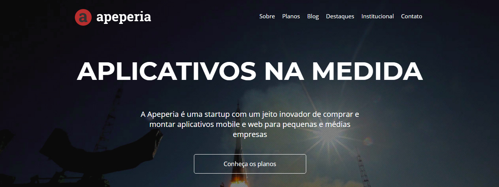

# Acessibilidade

### Projeto desenvolvido para o curso de *Acessibilidade web parte 1: tornando seu front-end inclusivo* do instrutor Natan Souza (Alura).

### 📚  Descrição

Objetivos do curso:

- Melhorar o site para usuários de leitor de tela;
- Entender como uma pessoa com deficiência visual usa a internet;
- Aprender a testar o site usando o NVDA;
- Compreender como detalhes no código podem impactar as pessoas;
- Utilizar técnicas front-end que podem ajudar os usuários;
- Deixar seu projeto ainda mais inclusivo.

### 🖥️  Instalações

- [Visual Studio Code](https://code.visualstudio.com/download)
- [NVA](https://www.nvaccess.org/)

### ⚒️  Tecnologias

As ferramentas utilizadas no projeto foram:

- HTML;
- CSS;
- JavaScript.

&nbsp;

##### Clique na imagem para visualizar a página:

&nbsp;

